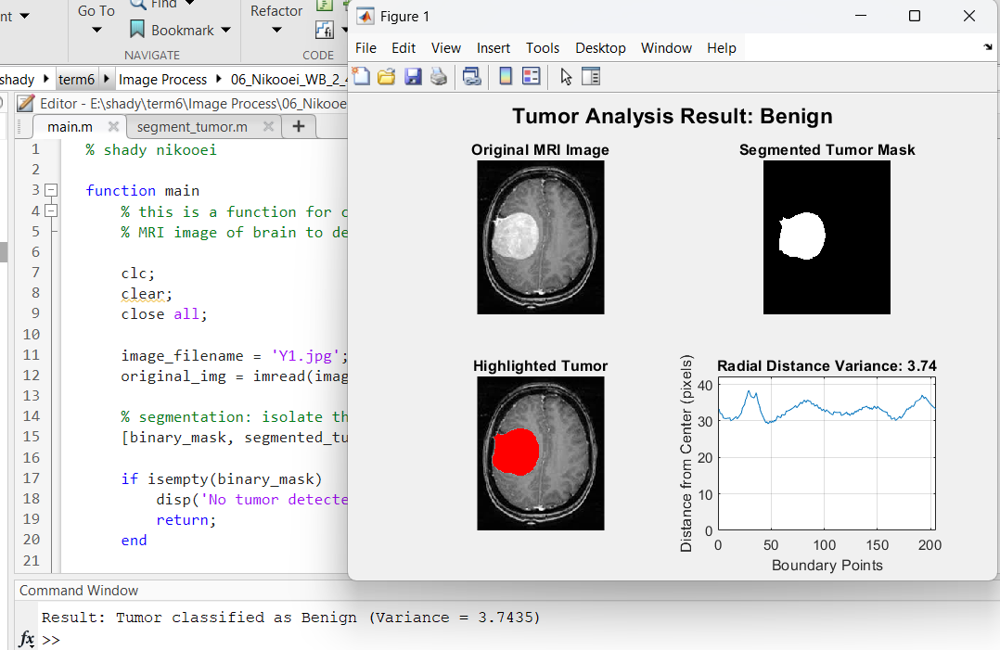

# Brain Tumor Segmentation and Classification in MRI

This project demonstrates a MATLAB-based approach for **brain tumor
detection and classification** using MRI images.\
The algorithm applies **morphological operations**, **thresholding**,
and **radial distance analysis** to segment the tumor region and
classify it as **Benign** or **Malignant** based on boundary variance.

## Features

-   Brain extraction from MRI scans using morphological processing.\
-   Tumor segmentation with adaptive thresholding.\
-   Feature extraction based on **radial distance variance**.\
-   Tumor classification into:
    -   **Benign**
    -   **Malignant**\
-   Visual outputs including:
    -   Original MRI image\
    -   Segmented tumor mask\
    -   Highlighted tumor region\
    -   Radial distance signature plot

## Output Example

Here is an example of the program output:

## Dataset

The MRI images used for this project were taken from the **Kaggle Brain
MRI Images Dataset**.\
([dataset_Kaggle](https://www.kaggle.com/datasets/navoneel/brain-mri-images-for-brain-tumor-detection))

## Important Note

This project is **purely academic and experimental**.\
It is **not a reliable medical diagnostic tool** and should not be used
for real clinical decisions.\
Results depend heavily on image quality and preprocessing.

------------------------------------------------------------------------

**Author:** Shady Nikooei\
**Field:** Digital Image Processing
